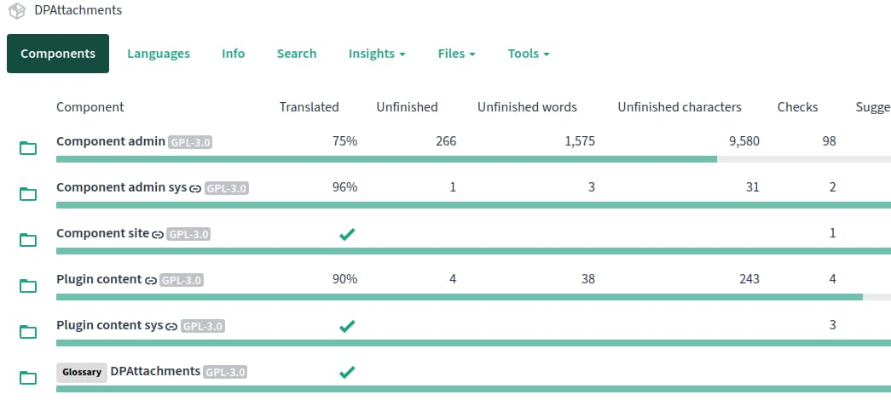
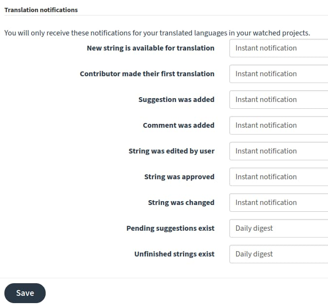

### Introduction
The DPAttachments Joomla project uses its own translation service to maintain all available language translations. Its an easy to use online tool based on Weblate, which can be used to update translations easily and without any in-depth or technical knowledge. Alternatively, it allows you to download the current translation and update it with your favorite tool. It also allows anyone to download the most current version of any translated file.

Having your language in the Digital Peak translation service is the only way to get it into DPAttachments.

### Language files
Every extension shipped with the DPAttachments package has a language folder where the translations/language files are located. For example, if you want to translate the DPAttachments frontend into your language, copy the file /components/com_dpattachments/language/en-GB/com_dpattachments.ini to /components/com_dpattachments/language/it-IT/com_dpattachments.ini and translate the English strings inside the double quotes.

### Language overrides
The strings in DPAttachments are loaded through the Joomla language manager. Joomla offers to overwrite these strings in the language manager of Joomla itself. More information can be found [here](https://docs.joomla.org/J3.x:Language_Overrides_in_Joomla).

Note: Most of the language strings of DPAttachments are in the administration part. So you need to make them for the location Administrator and do tick for both locations.

Note: Most of the language strings of DPAttachments are in the administration part. So you need to make them for the location Administrator and do tick for both locations.

### Join the Digital Peak translations service
Please follow the following steps to add your translation to DPAttachments.

1. **Register**  
You can register at [translate.digital-peak.com](https://translate.digital-peak.com/). Please use your username you are using on joomla.digital-peak.com!
2. **DPAttachments on the Digital peak translation service**  
You can find DPAttachments under this URL: [translate.digital-peak.com/projects/dpattachments](https://translate.digital-peak.com/projects/dpattachments)
3. **Create the language**  
Please create your language if there is no one yet. Please use the five digit xx_XX language code instead of the two digit language code. Or start translating an already existing language right now.
4. **Doing the translation**  
Go back to the mainpage of the DPAttachments project page: [translate.digital-peak.com/projects/dpattachments](https://translate.digital-peak.com/projects/dpattachments). There you can see a list of the components or languages. To translate one of those just click on it and navigate to the translations.

For further information visit [docs.weblate.org](https://docs.weblate.org/en/latest/user/translating.html).

### Enable notifications
To get notifications when new components or strings are added/updated, go to your [profile](https://translate.digital-peak.com/accounts/profile/#notifications) and set all option in the "Translation notifications" panel to "instant notification". This is very important to be able to maintain the extension you want.

#### Warnings
_**Please test that your language works in Joomla! before uploading the file into the Digital Peak translation service. Otherwise your translations may break during import!**_
